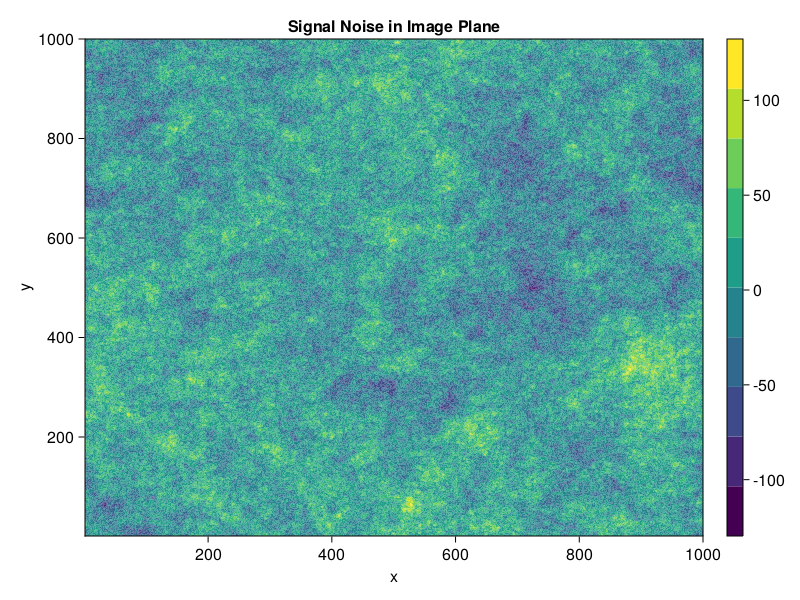

# Tutorial
This example code segment uses StationaryRandomFields.jl to generate correlated noise for a signal of given dimensions.

We begin by defining a noise signal object with dimensions input as a tuple. 
```@example 1
using StationaryRandomFields
using FFTW

# Define a 2D signal with dimensions (1000,1000)
signal = NoiseSignal((1000,1000))
```
We can immediately access the RFFT frequency grid that corresponds to the signal dimensions

```@example 1
ν = rfftfreq(signal)
```
We can also directly create Gaussian noise in Fourier space for the given signal with an optional input of the desired rng (if not the default).
This is not a necessary step as the NoiseGenerator will implement it automatically later.
```@example 1
gnoise = generate_gaussian_noise(signal)
```
Now construct the power spectrum to be used, designating the dimension in brackets. 
```@example 1
# Create a basic power spectrum with index β = -2
ps = SinglePowerLaw{2}(-2.)
```
The power spectrum may be modified via renormalization, rotation, and stretching
```@example 1
renormed_ps = 1000 * ps 
rotated_ps = rotated(renormed_ps, π/6) # π/6 is the rotation factor
stretched_ps = stretched(rotated_ps, 100, 100) # 100 is the stretch factor of both axes
```
The noise generator requires a [`ContinuousNoiseSignal`](@ref) as input, which can be created from the original [`NoiseSignal`](@ref)
```@example 1
cns = ContinuousNoiseSignal(signal)
```
We can now create our power spectrum noise generator, composed of the designated power spectrum and continuous noise signal. Note that the power spectrum and noise signal must be of the same dimension. The output `signoise` gives correlated power-law noise in the signal domain, with dimensions of the original [`NoiseSignal`](@ref) object.
```@example 1
noisegen = PSNoiseGenerator(stretched_ps, cns)
# generate signal noise
signoise = generate_signal_noise(noisegen)
```
## Plotting

We can now plot our generated signal noise in the signal domain:
```julia
using CairoMakie

# plot signal noise in position plane
xgrid = (1:signaltype.dims[1],1:signaltype.dims[2])
fig = CairoMakie.Figure()
ax = Axis(fig[1,1], title = "Signal Noise in Image Plane", xlabel = "x", ylabel = "y")
cplot = CairoMakie.contourf!(f[1,1], xgrid..., signoise)
Colorbar(fig[1,2], cplot)
fig
```

