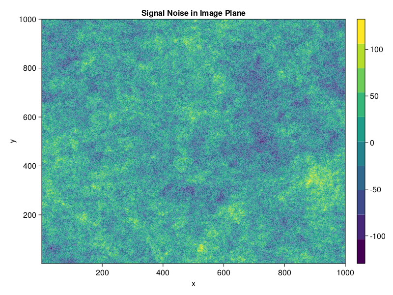

# Summary

The Julia package `StationaryRandomFields.jl` simulates realistic correlated noise for signal data of any given dimensions. The package follows the power-law noise procedure introduced by @timmer; we draw random Gaussian noise from a normal distribution in the Fourier frequency domain, scale it by the square root of a power law spectrum, and inverse transform back to the signal domain. Users can easily construct and modify their desired power scaling function provided by the module, or implement their own.

# Statement of Need

Many physical phenomena exhibit power-law noise correlation, in which fluctuations vary with temporal or spatial frequency as  $1/f^{\beta}$. This is of interest in radio astronomy imaging where material between the observer and source (such as that in our atmosphere) introduces image noise. Specifically, in VLBI (Very Long Baseline Interferometry) imaging of black hole Sagitarius A*, the ionized interstellar medium (ISM) acts as a scattering screen between earth and the black hole's location at our galactic center [@ehtsaga]. Ionized ISM plasma fluctuations are modelled as a power spectrum of spatial frequency, and thus produce image fluctuations of the same form. `StationaryRandomFields` provides a framework in the Julia Programming language for simulating such noise on N-dimensional data, for use that extends Event Horizon Telescope purposes and is applicable for any power law fluctuation phenomena.

# Mathematics

To generate correlated noise, the procedure designated in [@timmer] is followed. First, random Gaussian noise $G(\vec{f})$ is generated in the Fourier domain, by drawing from a normal distribution at each point in frequency space. The frequency space grid is computed simply from the size of the signal data itself. Fourier Gaussian noise is then scaled by the square root of a designated Fourier domain power function: 

$$ A(\vec{f}) = \sqrt{{P}(\vec{f})} = \sqrt{ f^{\beta}} $$

in which $\beta$ is a negative index and $f$ denotes the vector norm $|\vec{f}|$. This is the most basic power spectrum available for use, but the module allows for straightforward implementation of arbitrary user-defined power spectrums.

The power-law-scaled Fourier noise, ${F}(\vec{f}) = {G}(\vec{f}) \cdot {A}(\vec{f})$ is inverse Fourier transformed back into the signal domain to produce the output signal noise:

$$
    S(\vec{r}) = \frac{1}{N} \sum_{f = 0}^{N}F(\vec{f})e^{2\pi i \vec{f} \cdot \vec{r}}
$$ 

Reversing the process, the approximate power spectrum may be retrieved from a given signal noise $S(\vec{r})$ via a forward Fourier transform:

$$
    \bar{P}(\vec{f}) = |F(\vec{f})|^2 = |\frac{1}{N} \sum_{f = 0}^{N}S(\vec{r})e^{-2\pi i \vec{f} \cdot \vec{r}}|^2
$$

The approximated power spectrum output by `get_power_spectrum` divides this above result, $\bar{P}(\vec{f})$, by 2 to correct for a positively skewed offset in the squared amplitude of Gaussian noise.  

# Example Usage

This example code segment uses StationaryRandomFields.jl to generate correlated noise for a signal of given dimensions.

```
using StationaryRandomFields
using FFTW

# Define a 2D signal with dimensions (1000,1000)
signal = NoiseSignal((1000,1000))
cns = ContinuousNoiseSignal(signal)

# Now construct the power spectrum to be used, designating the dimension in brackets. 
ps = SinglePowerLaw{2}(-2.) # basic power spectrum with index β = -2

# The power spectrum may be modified via renormalization, rotation, and stretching
renormed_ps = 1000 * ps 
rotated_ps = rotated(renormed_ps, π/6) # π/6 is the rotation factor
stretched_ps = stretched(rotated_ps, 100, 100) # 100 is the stretch factor of both axes

# Now create a noise-generator corresponding to the signal and power law
# Note that the power spectrum and noise signal must be of the same dimension
noisegen = PSNoiseGenerator(stretched_ps, cns)

# Generate correlated power-law noise in the signal domain
signoise = generate_signal_noise(noisegen)

# We can now plot our generated signal noise in the signal domain:

using CairoMakie

xgrid = (1:signal.dims[1],1:signal.dims[2])
fig = CairoMakie.Figure()
ax = Axis(fig[1,1], title = "Signal Noise in Image Plane", xlabel = "x", ylabel = "y")
cplot = CairoMakie.contourf!(f[1,1], xgrid..., signoise)
Colorbar(fig[1,2], cplot)
fig
```

